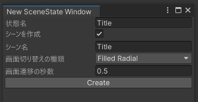
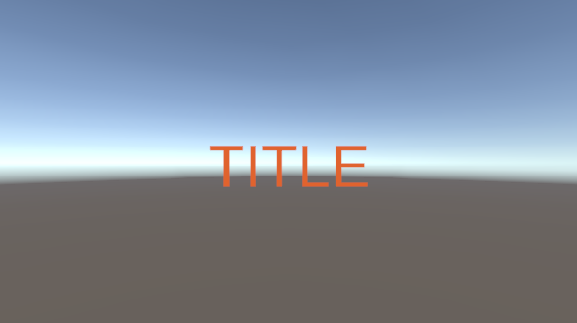
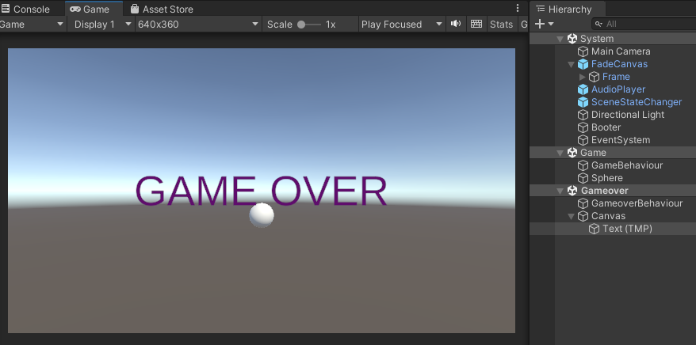
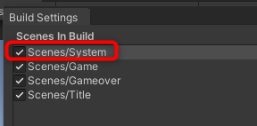

# シーンの切り替え

練習用の新規プロジェクトを作って、起動からシーンの切り替えを実装します。以下の簡易なゲームループを実装します。

- 起動(Boot)
  - 画面を隠す処理とボリュームシステムの初期化
  - 自動的にタイトルシーンへ切り替え
  - 切り替えはFilledRadial
- タイトルシーン(Title)
  - クリックしたら仮のゲームシーンへ
  - 切り替えはFilledRadial
- ゲームシーン(Game)
  - クリックしたらゲームオーバーシーンへ
- ゲームオーバーシーン(Gameover)
  - ゲームシーンにゲームオーバーシーンをマルチシーンで表示
  - クリックしたらタイトルへ戻る
  - 切り替えはFade

## 準備

新規にプロジェクトを作成して最初の設定をします。

1. Unity Hubを起動
1. Unity2021.3.Xで新規プロジェクトを作成。テンプレートは何でも構いません
1. プロジェクトフォルダー内の`Packages/manifest.json`をテキストエディターなどで開きます
   - Visual Studioなら以下の操作で開きます
     - ProjectビューのAssetsを右クリックして Open C# Project を選択
     - ソリューションエクスプローラーのホームの隣の ソリューションと利用可能なビューとの切り替え をクリックして フォルダービュー にします
     - `Packages/manifest.json`を開きます
1. dependenciesの最初に以下を追加します

```
    "jp.am1.baseframe": "https://github.com/am1tanaka/AM1BaseFrame21LTS.git?path=/Assets/AM1BaseFrame",
    "jp.am1.utils": "https://github.com/am1tanaka/AM1BaseFrame21LTS.git?path=/Assets/AM1Utils",
```

上書き保存してUnityに切り替えたら自動的にインストールが始まります。

パッケージのインストールが完了したら、プロジェクトで利用するアセットをインポートします。

1. ProjectウィンドウでAssetsフォルダーの下に新規フォルダーを作成して`Scripts`という名前にします
1. Toolsメニューから AM1 > Import BaseFrame Assets を選択します
1. 先に作成した`Scripts`フォルダーを選択します
1. インポートダイアログが表示されたらImportボタンをクリックします

途中でエラーが表示されてもインポートが完了したら消えるので気にせず進めてください。

以上でプロジェクトに必要なものの追加は完了です。


## シーンの作成

### システム用シーンの作成
必要なシーンを作成します。まずはシステム用のシーンを作ります。

1. SampleSceneシーンの名前を`System`に変更して、システム用のシーンとして使います
1. Toolsメニューから、AM1 > Set StateSystem to Active Scene を選択して、追加 をクリックします
1. Systemシーン用のオブジェクトの生成ダイアログが表示されたら追加をクリックします
1. TextMeshProのダイアログが表示されたらImport TMP Essentialsをクリックします
1. インポートが完了したらダイアログを閉じます
1. HierarchyウィンドウからBooterオブジェクトをクリックして選択します
1. InspectorウィンドウのAdd ComponentからBooterスクリプトをアタッチします

以上でシステムシーンの設定ができました。Playして画面が真っ白になれば成功です。これは起動に備えて画面を覆う処理を実行したままになっているからです。最初の状態とシーンを作成して切り替えることで処理を開始できます。

このシーンを最初に起動するようにします。他のシーンはマルチシーンで読み込んで、このシーンは破棄しません。常駐させたいオブジェクトやスクリプトを配置するためのシーンとしてSystemシーンを利用してください。

### 各状態シーンの作成

タイトル、ゲーム、ゲームオーバー用のシーンを作成します。
動作確認が目的なのでTextMeshProでシーン名を表示しただけの簡単なシーンにします。

## タイトルシーンの作成

本システムのシーン切り替えでは、読み込む全てのシーンのAwake()が完了するのを待つ処理と、切り替えを管理する`ISceneChanger`を実装したクラスが必要です。それらを自動的に行うツールメニューを使ってシーンを作成します。

1. Toolsメニューから AM1 > New SceneState を選択します
1. 状態名に作成するシーン名を入力します。今回は`Title`とします



3. 同名のシーンを作成して、シーン名もTitleにしたいのでそのままCreateボタンを押します
   - ここで画面切り替えの演出と秒数も設定できます
3. 保存先のフォルダーは`Assets`にします
   - 選択したフォルダー内に`Scenes`と`Scripts`フォルダーがあれば、その中に作成したシーンやスクリプトを保存します。フォルダーが無い場合は選択したフォルダーに作成します

以下のファイルが作成されます。

 - Scenes/Titleシーン
 - Scripts/TitleSceneStateChangerスクリプト

Titleシーンには`TitleBehaviour`オブジェクトに`AwakeReporter`スクリプトがアタッチされて配置されています。`AwakeReporter`スクリプトがシーンの起動を報告するスクリプトです。中身はシンプルなので他のシーン管理スクリプトを作成したら、そちらのAwake()に処理を移動しても構いません。

`TitleSceneStateChanger`スクリプトは、シーンの読み込みや初期化を呼び出すスクリプトを実装するためのスクリプトのひな形です。

あとは以下の手順でタイトル文字を表示します。

1. Hierarchyウィンドウの+をクリックして、UI > Canvas でTitleシーンにキャンバスを作成します
1. CanvasがSystemシーンに作られたら、ドラッグ＆ドロップでTitleシーンに移動してください
1. EventSystemをドラッグして、Systemシーンへ移動します
1. 作成したCanvasを選択します
1. Inspectorウィンドウで、Canvas ScalerのUI Scale ModeをScale With Screen Sizeにして、適当なReference Resolutionを設定して、Screen Match ModeをExpandにします
   - この作業は必須ではありませんが、レイアウト崩れ防止でやっておくと吉
1. 作成したCanvasを右クリックして、UI > Text - TextMeshPro を選択します
1. TITLEなど適当に文字を設定してレイアウトします



1. シーンを保存します

以上で完了です。HierarchyウィンドウでTitleシーンを右クリックしてRemove Sceneで解放します。

同様の手順で、Sphereを置いたGameシーン、GAME OVERと表示するGameoverシーンを作成します。シーンを作成したあとにスクリプトのビルドを待つ必要があるのでCreateボタンが有効になるまで少し待ってください。



## シーンの切り替えを実装

シーンの切り替えの実装方法です。切り替えに先立って、FileメニューからBuild Settingsを開いて、先に作ったSystem, Title, Game, Gameoverの4つのシーンをScene In Build欄に設定します。Systemを先頭にしてください。



### 起動からタイトルを表示

Systemシーンを開いてPlayすると、画面が白く覆われたままになります。タイトルシーンが起動するようにします。

起動やシーンを切り替える時の処理は`ISceneStateChanger`インターフェースを実装したクラスで行います。起動用のスクリプトはScriptsフォルダー内の`BootSceneStateChanger`です。これを開きます。

`OnHideScreen()`メソッドが以下のように実装されています。

```cs
    public override void OnHideScreen()
    {
        // ボリューム初期化
        new VolumeSetting((int)VolumeType.BGM, new BGMVolumeSaverWithPlayerPrefs());
        BGMSourceAndClips.Instance.SetVolumeSetting(VolumeSetting.volumeSettings[(int)VolumeType.BGM]);
        new VolumeSetting((int)VolumeType.SE, new SEVolumeSaverWithPlayerPrefs());
        SESourceAndClips.Instance.SetVolumeSetting(VolumeSetting.volumeSettings[(int)VolumeType.SE]);
        VolumeSlider.initEvents.Invoke();

        // 遅延再生初期化
        SESourceAndClips.Instance.InitDelaySEPlayer(System.Enum.GetValues(typeof(SEPlayer.SE)).Length, SEPlayer.DelaySeconds, SEPlayer.DelayMax);

        // ここに最初の状態への切り替え要求を追記
        // TitleSceneStateChanger.Instance.Request(true);
    }
```

このメソッドは画面が何らかの演出で覆われて、かつ、不要になったシーンの解放が完了したら呼び出されます。予め、BGMと効果音のボリュームシステムや遅延再生の初期化に加えて、最後にシーンの切り替え開始処理の呼び出し例がコメントアウトして書かれています。Titleシーンの名前を`Title`で作成していれば、コメントアウトされている`TitleSceneStateChanger`スクリプトが自動的に作成されているのでこれを呼び出すことができます。以下のようにコメントを外して、上書き保存してください。

```cs
        // ここに最初の状態への切り替え要求を追記
        TitleSceneStateChanger.Instance.Request(true);
```

上書き保存したらPlayして動作を確認してください。


Titleシーンの読み込みが完了したらFilled Radial(扇形の塗りつぶし)の演出で画面が表示されるようになりました。

### Play時のシーンについて
本システムでは、ビルド時の初期化エラーを避けるために起動から最初のシーンの切り替えまでスクリプトで制御します。Unityエディターで他のシーンを開いていても、それらは起動前に自動的に閉じるようになっています。

## ゲームシーンへの切り替え

シーンの切り替えは、シーン作成時に自動的に作られる`????SceneStateChanger`(`????`の部分はシーン名)クラスのインスタンスのリクエストを呼び出します。タイトルは自動的に起動させるために起動処理に書きましたが、呼び出すのはどこからでも構いません。

タイトルシーンで操作が可能になってから、クリックしたらゲームが開始する処理を作成します。

1. ProjectウィンドウのScenesフォルダーからTitleシーンをドラッグして、Hierarchyウィンドウにドロップしてマルチシーンで開きます
1. ProjectウィンドウでScriptsフォルダーを右クリックして、Create > C# Scriptで新しいスクリプトを作成します
1. 作成したスクリプトの名前を`TitleBehaviour`にします
1. ProjectウィンドウからTitleBehaviourスクリプトをドラッグして、HierarchyウィンドウのTitleBehaviourオブジェクトにドロップしてアタッチします
1. HierarchyウィンドウでTitleBehaviourスクリプトをダブルクリックして開きます

画面の表示演出が完了してシーンが開始したかどうかは、SceneStateChangerクラスの`IsStateStarted()`メソッドで確認することができます。

6. TitleBehaviourスクリプトの最初の方に以下の`using`を追加します

```cs
using AM1.BaseFrame;
```

7. Update()メソッドを以下のように実装します

```cs
    void Update()
    {
        if (!SceneStateChanger.IsStateStarted(TitleSceneStateChanger.Instance)) return;

        if (Input.GetButtonDown("Fire1"))
        {
            GameSceneStateChanger.Instance.Request();
        }
    }
```

最初のif文でタイトルが開始したかを確認して、falseでまだ切り替え中ならreturnして処理をしないようにしています。このif文をプレイヤーや敵などの更新スクリプトに入れれば、画面切り替え中に動かないようにできます。

次のif文でFire1で定義してあるキー（デフォルトではクリックやスペースキー）が押されたかを確認して、ゲームシーンへ切り替えする要求を呼び出しています。

### 動作確認

以下の点について動作を確認してみてください。

- Playしてからクリックを連打して、タイトルからゲームに切り替わるタイミングを確認
- ゲームシーンへの切り替えが始まってからもクリックを連打し続ける

いずれもシーン切り替え時の不具合ポイントです。

何も対策をしていないと、前者はタイトルが表示される前にゲームが始まってしまいますし、後者はゲームシーンを何度も読み直したり、沢山読み込んだりしてしまいます。そのような不具合が起きないような対策がしてあります。

### ????SceneStateChanger.Instance.Request()の引数

タイトルが起動する時は`TitleSceneStateChanger.Instance.Request(true);`、ゲームの起動時は`GameSceneStateChanger.Instance.Request();`を実行しました。前者には引数でtrueを渡し、後者は省略しています。

Request()メソッドの引数にtrueを渡すと、すでに別のシーン切り替えの要求が出ていたり、シーンが切り替え中だった時は要求をキューに積みます。前のシーン切り替えが終わったら、キューに積んだシーンに更に切り替える、いわば予約切り替えモードになります。

引数を省略するかfalseを渡すと、すでにシーンの切り替え要求が出ていたり、シーン切り替え中の時は、新しいシーン切り替えの要求をキャンセルするモードになります。

タイトルシーンは起動処理中にシーン切り替えを予約したいので引数にtrueを渡しました。通常は、例えばゲームクリアと同じフレームでゲームオーバーになった場合など先に登録したシーンの切り替えのみを有効にして、それ以降の登録は無効にしないと動作がおかしくなります。そのため引数は省略するのが基本です。


