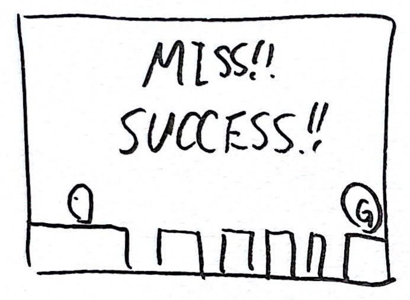

# デモゲーム

## 操作
クリックかスペースキーのみ。

## 進行

- クリックやスペースキーで移動開始
- クリックやスペースでジャンプ
- 画面右端に到着したらSUCCESS!!
- 落下したらMISS!!
- kenney.nlを利用

### ゲームの状態
1. WaitStartState 状態開始待ち
2. WaitStart「Click or Space Key : Start and Jump!」
3. Game クリックかスペースキーで2を消してキャラクター移動開始
5. Result 落下かクリア

### プレイヤーの状態
1. WaitStart スタート待ち。重力含めて一切処理しない
2. Run 重力落下+走る。クリックかスペースキーでジャンプ
3. Miss 落下
4. Clear クリア。クリアアニメ

## プレイヤー制御
簡易なDemoのためのプレイヤーなので操作の入れ替えは想定せずにDemoPlayerスクリプト一つで制御する。

重力と着地処理はRigidbody2Dに任せず、自前で実装する。Rigidbody2Dの設定は以下の通りとする。

- Body Type: Kinematic
  - 重力を利用せずにMovePositionで移動
- Simulated: true
  - Collider2Dを有効にしたいのでtrue
- Use Full Kinematic Contacts: false
  - 接触は不要なのでfalse

## 操作
- Spaceキー / 左クリック： ジャンプ
  - 長押しでジャンプ高く

## プレイヤーオブジェクトの設定
- Tag: Player
- Layer: Player
- Physics2Dの設定でPlayerレイヤー同士の接触を解除
- BoxCollider2D
  - 体と足元の判定範囲に設定
  - IsTrigger: true

## 地面
地面はTileMapで作ってます。以下を設定しておきます。

- Layer: Block
- Tilemap Collider2Dをアタッチ
- Is Trigger: true

## ジャンプ
- 地面にいる状態で操作でジャンプ開始
- ジャンプ開始から一定秒数以内の時、重力加速なし
- ボタンを離したらジャンプ開始時間を0にして加速有効

## 何故当たり判定を自前で行うのか
地面を歩くキャラクターの当たり判定をBoxColliderでやると、ちょっとした段差にひっかかって動けなくなることがあります。これを避けるためにCapsule Colliderを使う方法があるのですが、足元が円形だと地面の端で少し下がったり落下することで変な動きをする原因になります。また、Physicsによる強制的な接触回避判定は融通が利かず、特に重なった時に様々な動きのバリエーションがある2Dでは問題になることが多いです。

以上のようなことから、2Dのプラットフォーマーゲームでの接触判定は自分で作ることが多いです。UnityのPhysicsにはCastやOverlapといった便利メソッドが用意されているので考え方さえ分かってしまえば難しいことはありません。

ColliderやPhysicsといった物理系の処理は、座標を変更しても次の物理更新が実行されるまでは前の状態になっています。

動く者同士をCastやOverlapで判定する場合は一点、注意があります。これらのメソッドは高速に結果を求めるために、前回の物理更新の結果を使って判定をします。そのため、動くものAとBの接触判定をしようとした場合、Aを動かした後に、BからAとの接触位置を求めると、Aが動く前の位置で検出されます。Aを動かした後に物理状態を更新して最新に保つ設定もあるのですが、重くなるのであまり使いたくありません。この原則が分かっていれば、接触判定の時に移動量も考慮して行えば問題なくなります。

今回はプレイヤー以外に動くものがないのでそのような処理は考慮していません。
