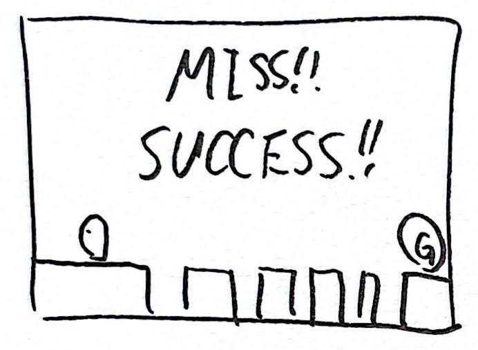

# Unity2021LTS版フレームワーク

## 機能
　Unity1週間ゲームジャムやサンプルゲームで使える汎用的なフレームワークをまとめる。変更なしで別プロジェクトに組み込めるものはPackageManager、利用先のプロジェクトに組み込んで変更する前提のものはunitypackageファイルでインポートする。実装例専用のものは`Assets/AM1BaseFrame/Samples~`にまとめる。

- インターフェースによる状態の切り替え
- シーン切り替え時にフェードなどで画面を覆う
- スタックと優先度付きキューによる状態管理
- BGMとシステム効果音のボリュームをAudioMixerで管理
- BGMと効果音用スライダースクリプト
- PlayerPrefsの初期化と読み込み
- PlayerPrefsへのボリュームの保存
- [デモゲーム](./Spec/demo.md)
- 各機能の簡単なサンプルとドキュメント

