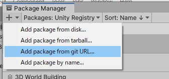

# AM1BaseFrame21LTS
フレームワークや共通コード、フェーズシステムなどの自家製汎用パッケージの開発リポジトリ。本リポジトリからフォルダーを公開リポジトリーにアップして、自家製パッケージとして利用する。

## 対象バージョン
- 開発 Unity2021.3.10f1
- 対応 Unity2020LTS以降

## サンプルフォルダーへのシンボリックリンクの作成
サンプルフォルダーはUnityの管理外にするため直に参照できない。以下でシンボリックリンクを作成してUnityに認識させる。

### Windows
参考 https://learn.microsoft.com/ja-jp/powershell/scripting/windows-powershell/wmf/whats-new/new-updated-cmdlets?view=powershell-7.2

- Assetsフォルダーへ移動
- 以下はPhaseSystemのサンプルへのシンボリックリンクの作成例

```
New-Item -ItemType SymbolicLink -Path ./AM1PhaseSystemSample.win -Value ./AM1PhaseSystem/Samples~
```

- .gitignoreに作成したシンボリックリンクを無視するよう設定

### Mac

```
ln -s ./AM1PhaseSystem/Samples~ .
```

作成後に`.mac`を付けて名前を変更して、.gitignoreに作成したシンボリックリンクを無視するよう設定。

シンボリックリンクの削除は以下。

```
unlink シンボリックリンクのパス
```


## 機能

以下の機能を提供します。

- 状態の定義と切り替え
- 状態の切り替えと画面を覆う演出の連携
- 画面を覆う演出サンプルとしてフェードと扇形塗りつぶし
- BGMとシステム効果音の再生
- BGMと効果音のボリュームスライダーと設定の保存と読み込み
- 新しい状態やシーンを作成するエディター拡張

## インポート手順
以下、フレームワークのインポート手順です。Unity2021.3.10f1での手順を示しています。別バージョンの場合は手順が異なるかも知れません。

1. フレームワークを組み込みたいUnityプロジェクトを開きます
1. WindowメニューからPackage Managerを開きます
1. + をクリックして Add package from git URL... を選択します



1. `` を入力して、Addをクリックします

以上でインポートが始まります。


## 使用アセット
- キャラクター、マップチップ、背景
  - [www.kenney.nl Platformer Assets Base](www.kenney.nl)
- BGM
  - [www.kenney.nl Music Loops/Retro](www.kenney.nl)
効果音
  - [www.kenney.nl Interface Sounds](www.kenney.nl)
  - jump drop_004.ogg
  - Start confirmation_001.ogg
  - Cursor bong_001.ogg
  - Miss error_007.ogg
  - Success confirmation_002.ogg

## ライセンス
